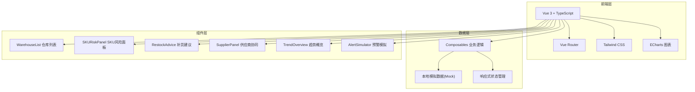
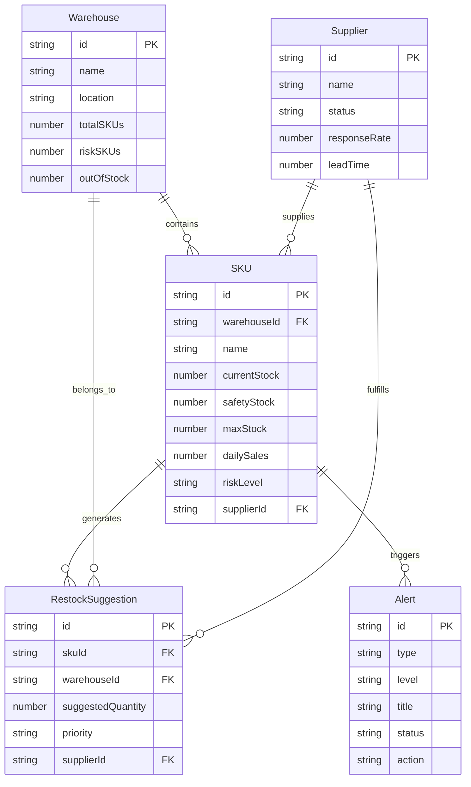

## 1. 架构设计



## 2. 技术说明

- 前端：Vue 3 + TypeScript + Tailwind CSS + Vite
- 初始化工具：vite-init
- 后端：无（纯前端，使用本地模拟数据）
- 数据库：无（使用内存中的 Mock 数据）
- 图表库：ECharts（通过 echarts 和 vue-echarts）
- 图标：lucide-vue-next

## 3. 路由定义

| 路由 | 用途 |
|------|------|
| / | 看板主页面，包含所有功能模块 |

## 4. API 定义

无后端 API，所有数据通过本地 Mock 数据生成，使用 Composables 封装业务逻辑。

### 数据接口定义

```typescript
interface Warehouse {
  id: string
  name: string
  location: string
  totalSKUs: number
  riskSKUs: number
  outOfStock: number
  capacity: number
  usedCapacity: number
}

interface SKU {
  id: string
  warehouseId: string
  name: string
  category: string
  currentStock: number
  safetyStock: number
  maxStock: number
  dailySales: number
  riskLevel: 'out_of_stock' | 'critical' | 'low' | 'normal'
  supplierId: string | null
  tags: string[]
}

interface Supplier {
  id: string
  name: string
  status: 'online' | 'offline' | 'responding'
  responseRate: number
  leadTime: number
  reliability: number
  skuIds: string[]
}

interface RestockSuggestion {
  id: string
  skuId: string
  skuName: string
  warehouseId: string
  currentStock: number
  suggestedQuantity: number
  targetStock: number
  priority: 'urgent' | 'high' | 'medium' | 'low'
  supplierId: string | null
  supplierStatus: string
  estimatedDelivery: string | null
  tags: string[]
}

interface Alert {
  id: string
  type: 'out_of_stock' | 'below_safety' | 'supplier_delay' | 'supplier_missing'
  level: 'critical' | 'warning' | 'info'
  title: string
  message: string
  skuId: string | null
  warehouseId: string | null
  supplierId: string | null
  timestamp: string
  status: 'pending' | 'processing' | 'resolved'
  action: string
}

interface TrendData {
  date: string
  stockLevel: number
  alertCount: number
  restockCompletionRate: number
}
```

## 5. 服务器架构图

不适用（纯前端项目）

## 6. 数据模型

### 6.1 数据模型定义



### 6.2 数据定义语言

使用 TypeScript 接口定义数据模型，通过 Mock 数据文件初始化。
